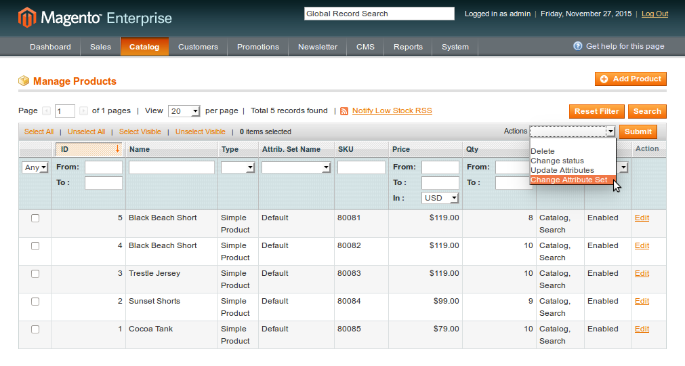
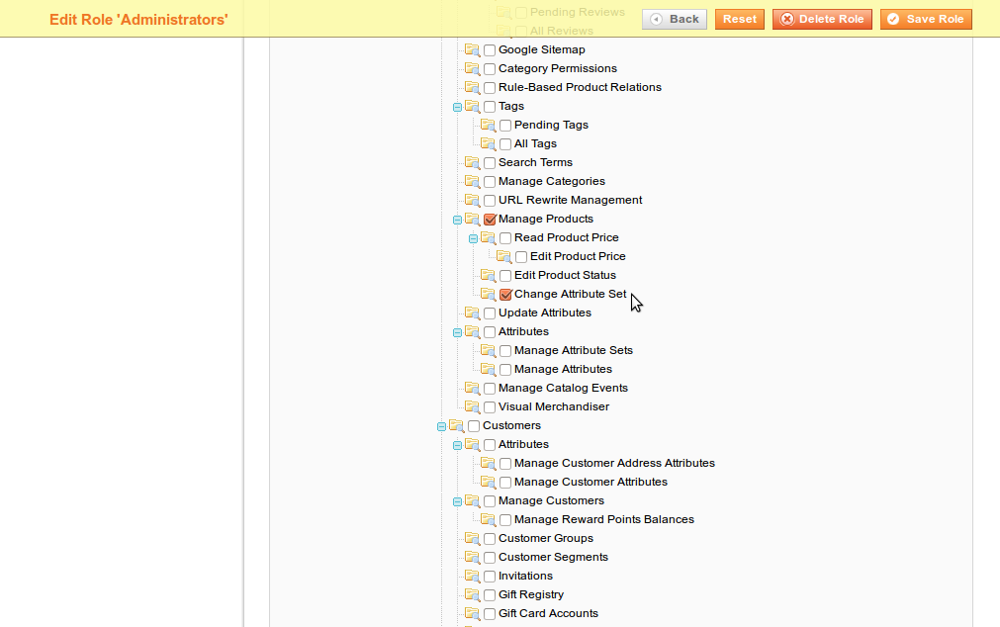

ChangeAttributeSet
==================

What does ChangeAttributeSet do?
--------------------------------

In Magento every product has a fixed attribute set that cannot be changed after the product's creation. This is in many productive contexts not an acceptable limitation. This module overrides the standard behaviour and makes it possible to change attribute sets after the item's creation making Magento even more flexible. :).

Now completely without rewrites, so it should be fully compatible with other Modules.

Documentation
-------------

Change the Attribute Set of any Product:

Allow or Deny Changing the Attribute Set for certain User Roles using ACLs:

Enable deletion of orphan data:

